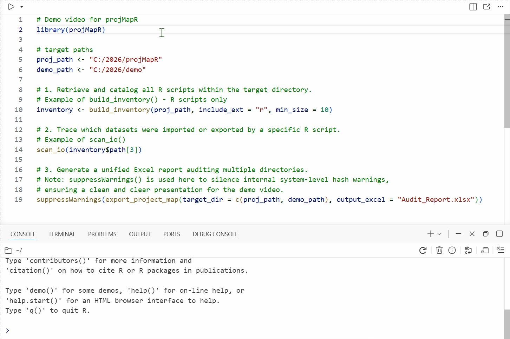
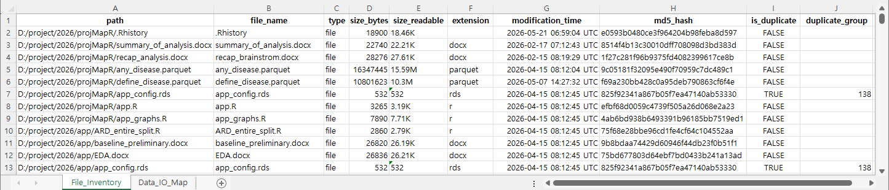
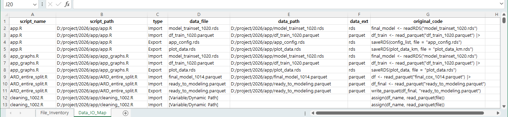

# projMapR 

[](https://lifecycle.r-lib.org/articles/stages.html#experimental)

**`projMapR`** is an R package designed to help data scientists and clinical researchers organize, audit, and standardize their project directories. It automates the tedious tasks of inventorying files, identifying duplicates, and mapping the lineage of data flowing through R and Python scripts.

## Why use `projMapR`?

When research projects scale, file structures often degrade into messy data silos. You can easily end up with redundant versions of the same dataset and lose track of the specific scripts responsible for generating them. `projMapR` resolves this by:

-   **Building a Clean Inventory:** Recursively scans folders to extract comprehensive file metadata across single or multiple project roots simultaneously.
-   **True Duplicate Detection:** Utilizes cross-repository MD5 hashing to pinpoint files that are identical in content, regardless of their filenames.
-   **Data Lineage Mapping:** Automatically parses your R (`.R`) and Python (`.py`) scripts to trace exact **import** and **export** operations while gracefully filtering dynamic loop variables and network paths.
-   **Collaboration Ready:** Exports the entire project architecture into a professional, multi-sheet Excel report for seamless team audits.

## Quick Demo & Excel Outputs

Watch `projMapR` scan directories and parse scripts, then instantly preview the multi-sheet, audit-ready Excel workbooks generated with a single command. \### 1. Package Demonstration (GIF)



### 2. Sheet 1: Unified File Inventory & Duplicate Detection

**Key Visual:** `size_bytes` (numeric) allows seamless spreadsheet sorting, while identical files across different repositories are flagged via cryptographic MD5 hashing.



### 3. Sheet 2: Cross-Language Data Lineage Map

**Key Visual:** Absolute NAS paths are isolated into raw file titles, and dynamic loop variables are gracefully standardized into `[Variable/Dynamic Path]` blocks.



------------------------------------------------------------------------

## Key Features in the Latest Release

-   **Comprehensive Multi-Language Parsing:** `scan_io()` now seamlessly tracks data lineage across **R (`.R`, `.Rmd`)**, **Python (`.py`)**, **Jupyter Notebooks (`.ipynb`)**, and **Stata (`.do`)** scripts.
-   **Context-Based Extension Inference:** Intelligently corrects versioned or extensionless files (e.g., `dataset_v0.1` saved via `saveRDS()` is accurately mapped to `rds`).
-   **Robust Path Cleansing:** Automatically handles absolute network paths (NAS), isolates pure file titles, and eliminates trailing `/NA` ghost paths from dynamic script loops.
-   **Excel-Friendly Sizing:** Logs file sizes as both raw numeric bytes (`size_bytes`) for spreadsheet filtering/sorting and human-scannable strings (`size_readable`).

------------------------------------------------------------------------

## Installation

You can install the development version of `projMapR` from [GitHub](https://github.com/) with:

``` r
# install.packages("pak")
pak::pak("jyleejay/projMapR")

# install.packages("remotes")
remotes::install_git("https://github.com/jyleejay/projMapR.git")
```

## Quick Start

Map your entire project architecture with a single command:

``` r
library(projMapR)

# Analyze the current project and export an audit-ready Excel report
export_project_map(target_dir = ".", output_excel = "Project_Audit_Report.xlsx")
```

### Advanced Usage

**1. Build a Detailed File Inventory**

``` r
# Scan multiple production folders at once while isolating specific formats
# Filter by extension and file size
inventory <- build_inventory(
  target_dir = c("D:/project1/data", "E:/project2/main"), include_ext = c("xlsx", "r"), min_size = 1000)

# Sort your inventory flawlessly in R by its raw numeric byte sizes
sorted_inventory <- inventory[order(-inventory$size_bytes), ]

# Detect true duplicates to clean up storage
duplicates <- inventory[inventory$is_duplicate == TRUE, ]
```

**2. Trace Complex and Dynamic Script I/O Lineage**

``` r
# Audit a script; dynamically managed loops will cleanly display [Variable/Dynamic Path]
# while explicit file executions extract dedicated context metadata
flow_map <- scan_io("scripts/analysis_v1.R")
```

**3. Verify File Integrity**

``` r
# Compare local scripts against NAS backups, ignoring OS-specific line endings (CRLF vs LF)
compare_files("scripts/analysis_v1.R", "Z:/NAS_backup/scripts/analysis_v1.R", method = "text")

# Ensure two binary data files are identical byte-for-byte
compare_files("data/raw_data.rds", "data/backup_data.rds", method = "hash")
```

------------------------------------------------------------------------

## Key Functions

| Function | Description |
|:-----------------------------------|:-----------------------------------|
| `build_inventory()` | Scans a directory for metadata and calculates MD5 hashes. |
| `scan_io()` | Parses an R or Python script to find `read` and `write` operations. |
| `export_project_map()` | The master wrapper that orchestrates multi-path scanning and dumps structured Excel reports. |
| `compare_files()` | Validates if two files are identical using byte-level hashing or text comparison. |

------------------------------------------------------------------------

## Contributing

Contributions are welcome! If you find a bug or have a feature request, please open an issue or submit a pull request.

## License

This project is licensed under the **MIT License**.
